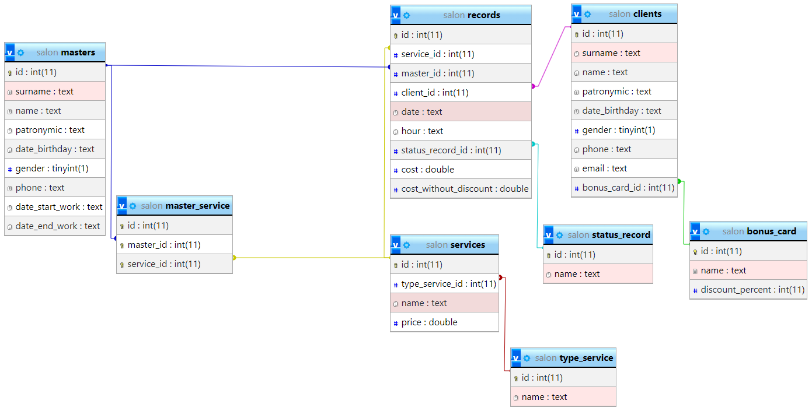

# Установка системы
Для установки системы, необходимо сделать следующие шаги:
 - Скачать OpenServer (полный пакет)
 - Убедиться что конфигурация следующая
 - PHP 7.2
 - MySQL-5.6
 - Скопировать весь проект в (OSPanel/domains)
 - В настройках OSPanel в вкладке "Домены", прописать имя домена salon.local, папка домена (текущая папка скопированная в шаге ранее)
 - Зайти в phpmyadmin
   - В нем необходимо создать нового пользователя
   - Создать пустую БД
   - Выполнить весь SQL код из файла description-project/salon.sql
 - Создать файл config.php и из примера config-example.php заполнить его
 - (ДАННЫЙ ШАГ НЕ НУЖЕН ЕСЛИ УЖЕ В КОРНЕ ПРОЕКТА ЕСТЬ ПАПКА `vendor`) Открыть консоль через OSPanel (Дополнительно - Консоль)
   - Пройти в корень проекта
   - Прописать composer install (ЕСЛИ ЗАБЛОКИРОВАН РЕСУРС, ТО ПРОСТО СКОПИРОВАТЬ ПАПКУ `vendor` в корень проекта)
 - Перейти в браузере по ссылке http://salon.local 

# Зависимости проекта
Проект имеет следующие зависимости
 - phpSpreadSheet: Для генерации Excel документов

# UML Схема
